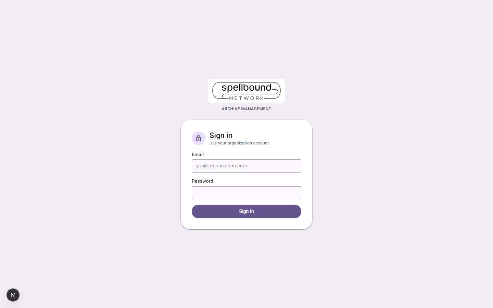

[← Manual home](README.md)

# Getting started

## Signing in

Go to your organization's Archivo URL — you'll land on the sign-in screen if
you don't already have a session.

*Email + password sign-in. There is no self-service "Create account" here —
an Administrator creates your account and assigns your role (see
[Roles & permissions](settings/roles.md)).*

1. Enter your **Email** and **Password**.
2. Select **Sign in**.
3. You're taken to the [Dashboard](02-dashboard.md).

If your email/password don't match, the form shows an error in place and
your password field is cleared — nothing is logged. There's no
"forgot password" self-service flow yet; ask an Administrator to help you
regain access.

## The app shell

Once signed in, every page shares the same frame:

- **Left navigation rail** (desktop) — Dashboard, Search, Inbox, Reports,
  Audit, Settings, plus a **+** button that jumps straight to
  [New Archive](03-archives.md#creating-an-archive). On narrow/mobile
  screens this collapses into a hamburger menu that opens a slide-out
  drawer instead — see the [Dashboard](02-dashboard.md#on-mobile) page.
- **Top bar** — your organization's name and logo, a global search box
  (`Ctrl/⌘ K` — see [Dashboard](02-dashboard.md#global-search-ctrlk)), a
  theme toggle, a notification bell, and your account menu.
- **Main content** — whatever page you're on.

Only what your role allows appears — for example a Viewer's nav rail and
quick-actions row don't include Settings, and someone without upload rights
won't see upload controls. This manual notes role restrictions wherever they
apply.

## Demo accounts (for testing/training)

If you're evaluating Archivo against the seeded demo organization, these
accounts exist out of the box (password `Password123!` for all):

| Email | Role |
|---|---|
| `admin@demo-ngo.org` | Administrator |
| `officer@demo-ngo.org` | Archive Officer |
| `deptuser@demo-ngo.org` | Department User |
| `viewer@demo-ngo.org` | Viewer |

In a real deployment, replace/remove these and create real accounts via
[Roles & permissions](settings/roles.md).

## Next steps

- New here? Start with the [Dashboard](02-dashboard.md) to get oriented, then
  [Archives](03-archives.md) to create your first archive.
- Setting up the organization for the first time? See
  [Settings overview](11-settings-overview.md).
