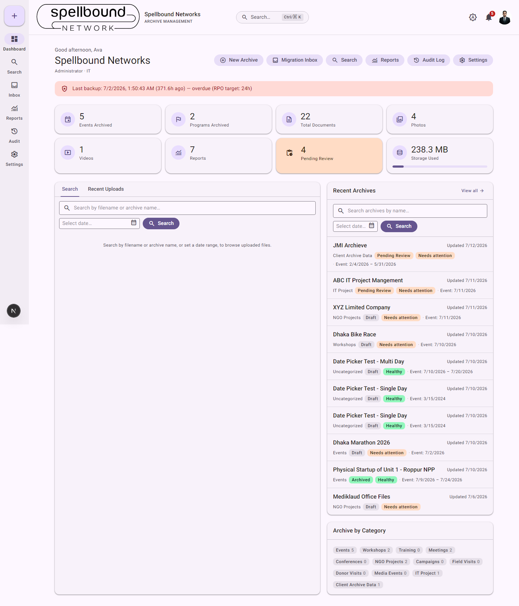
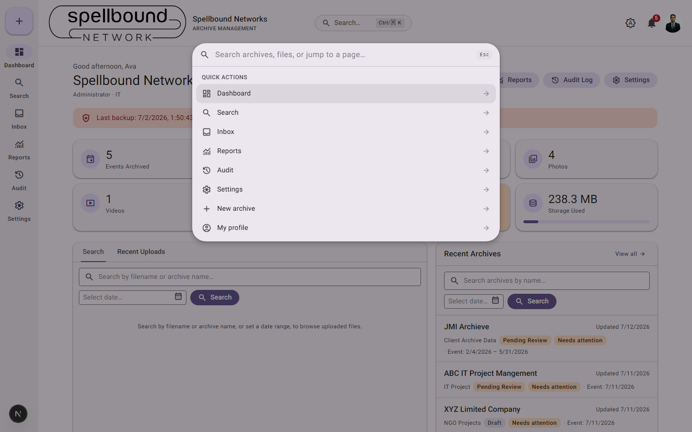
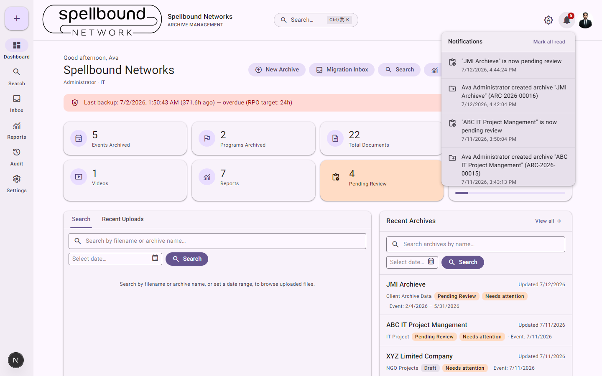
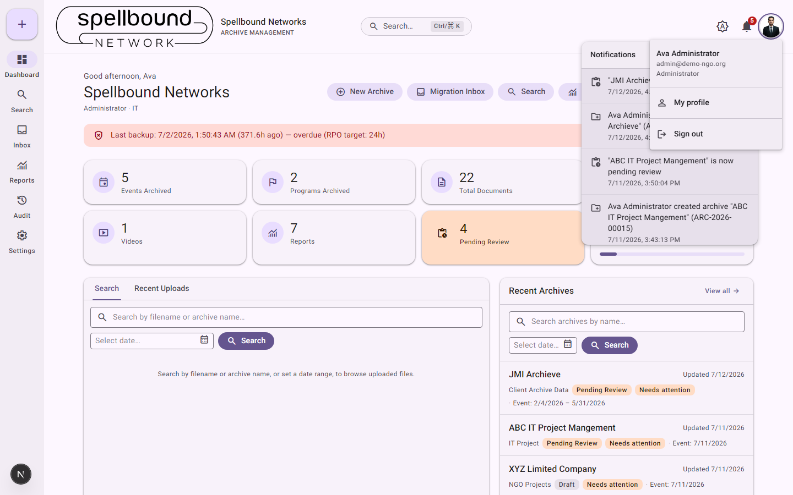
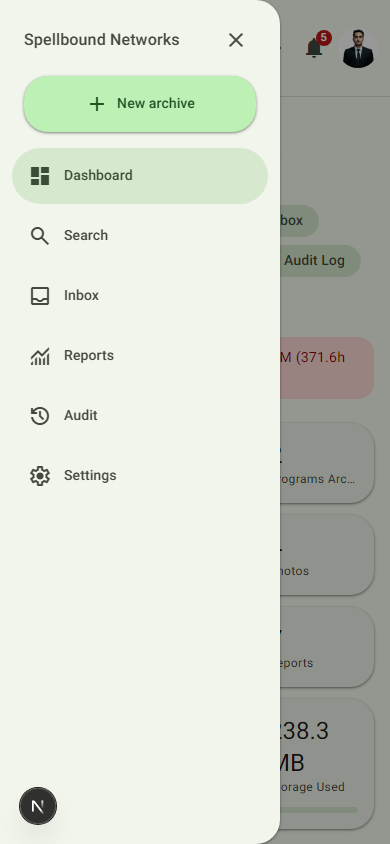
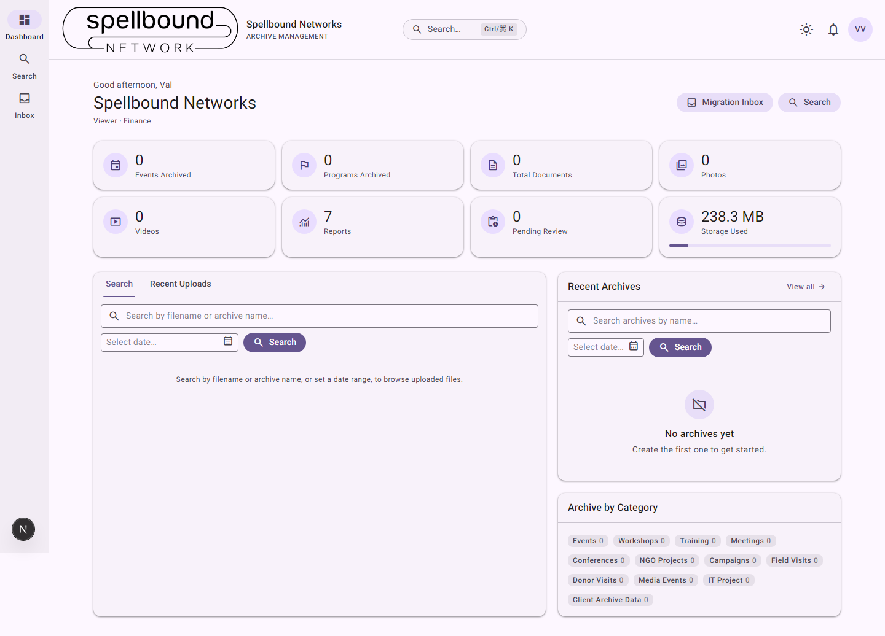

[← Manual home](README.md)

# Dashboard

The dashboard is the home screen after sign-in (and the destination of the
"Dashboard" nav item and logo click at any time). It's a summary, not a
management view — it links out to the full [Search](06-search.md) and
[Archives](03-archives.md) pages for anything beyond a quick glance.

## What's on it

- **Greeting header** — your name, organization name, your role and
  department, and a **quick-actions row** (New Archive, Migration Inbox,
  Search, Reports, Audit Log, Settings). Only the actions your role can
  actually use appear — see [Roles & permissions](settings/roles.md).
- **Backup status banner** (Administrators / anyone with `canManageSettings`
  only) — green when the last backup is under 24 hours old, red "overdue"
  past that. This reflects the command-line backup tool described in
  [Backups](12-backups.md); the app itself doesn't run backups
  automatically.
- **Stat cards** — Events Archived, Programs Archived, Total Documents,
  Photos, Videos, Reports, Pending Review, Storage Used. Each is a shortcut:
  clicking one jumps to [Search](06-search.md) or [Reports](07-reports.md)
  pre-filtered to that slice (e.g. the Pending Review card opens Search
  filtered to that status).
- **Search / Recent Uploads panel** (tabs) — a quick filename/archive search
  right on the dashboard, or a browse of the most recently uploaded files.
  This is a lighter version of the full [Search](06-search.md) page for
  quick lookups.
- **Recent Archives** — up to 10 most-recently-updated archives, each
  showing category, status, and health badges. **View all** goes to the full
  archive search.
- **Archive by Category** — a chip row showing how many archives exist per
  category, matching your organization's [folder-template categories](settings/folder-templates.md).

## Global search (Ctrl/⌘K)

Click the search box in the top bar, or press **Ctrl K** (⌘K on Mac), from
anywhere in the app:

- Type to filter **Quick actions** (the same destinations as the nav rail,
  plus "New archive" and "My profile") — matched instantly, no network call.
- Type 2+ characters to also search **archives and files** by name — results
  stream in after a brief pause as you type.
- **Arrow Up/Down** to move the highlighted result, **Enter** to open it,
  **Escape** or click outside to close.

This is a "jump somewhere fast" tool, scoped to what you're allowed to see —
it does not replace the full filterable [Search](06-search.md) page.

## Notifications

Click the bell icon (badge shows your unread count) to open the panel:

Each entry links to the archive it's about. **Mark all read** clears the
badge. See [Notifications](09-notifications.md) for the full list of what
triggers an alert.

## Account menu

Click your avatar (top-right) for your name/email/role, a link to
[My profile](10-profile.md), and **Sign out**:

## On mobile

Below the desktop breakpoint, the left navigation rail collapses behind a
hamburger button in the top bar. Tapping it opens the same set of
destinations as a slide-out drawer:

## What a non-admin sees

Roles without settings/admin access get a lighter dashboard — no backup
banner, no Reports/Audit/Settings in the nav rail, and a shorter
quick-actions row:

*The stats and Recent Archives show empty here because this particular demo
Viewer belongs to a department with no archives of its own and doesn't have
the "View all archives" permission (see
[Roles & permissions](settings/roles.md)) — not because the organization has
no data. What a dashboard shows is always scoped to what that person can
actually see.*
