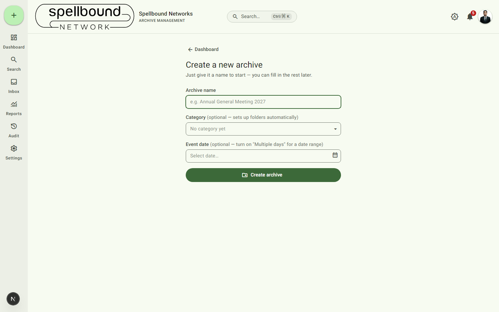
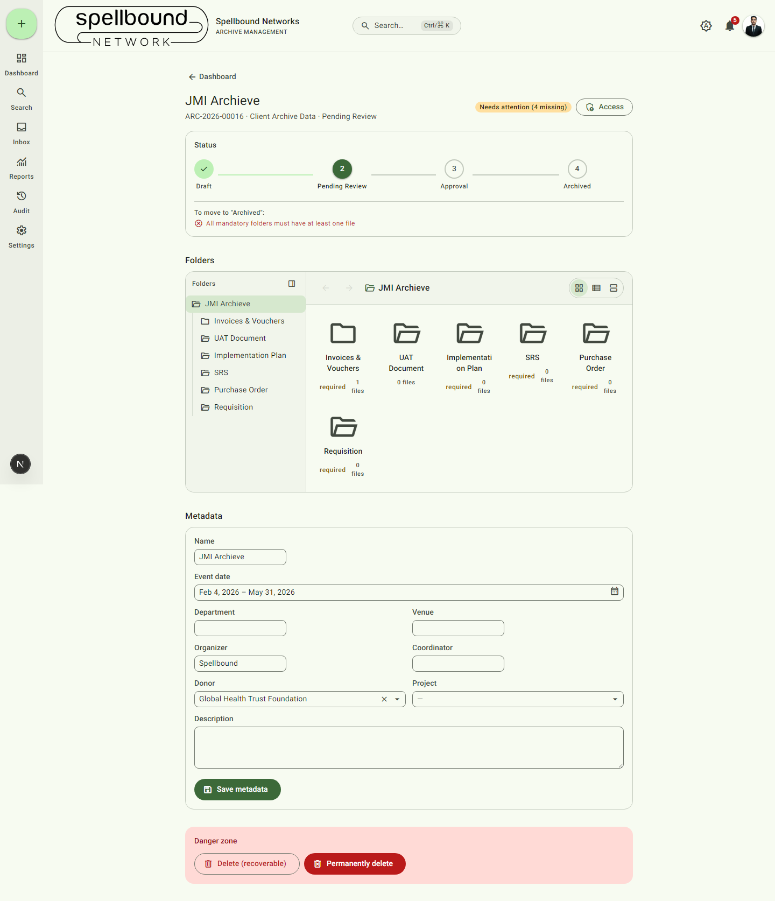
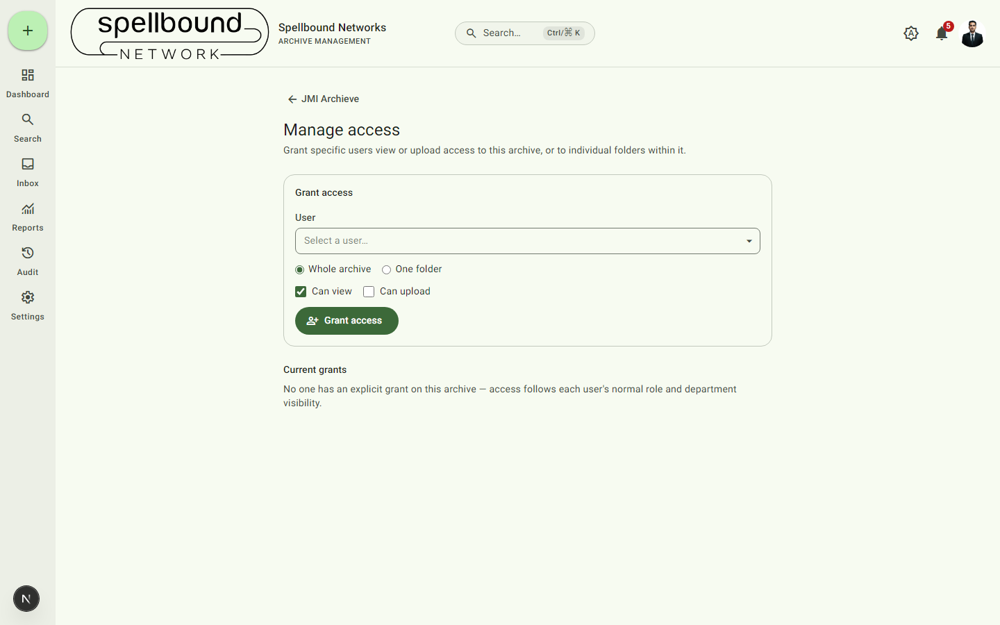

[← Manual home](README.md)

# Archives

An archive is the container for one event, program, or project — see
[core concepts](00-introduction.md#core-concepts) if you haven't read the
introduction. This page covers creating one and everything on its detail
page; for what's inside a folder (uploading, versioning, previewing,
sharing), see [Files](04-files.md).

## Creating an archive

Select **New Archive** from the dashboard quick-actions row, the **+** button
in the nav rail, or the command palette.

1. **Archive name** — required. This is the only required field; everything
   else can be filled in later.
2. **Category** (optional) — choosing one immediately provisions the archive
   with that category's configured folder set (see
   [Folder templates](settings/folder-templates.md)). Leaving it blank
   creates an "Uncategorized" archive with no folders yet.
3. **Event date** (optional) — a single date, or toggle **Multiple days** for
   a date range.
4. Select **Create archive**.

You land directly on the new archive's detail page, ready to upload. An
auto-generated reference number (`ARC-2026-000NN`) is assigned and shown
next to the archive name everywhere it's listed.

## The archive detail page

This is where day-to-day work happens: uploading files, tracking status, and
editing metadata. From top to bottom:

### Header
Archive name, reference number, category, current status, and its
**Archive Health** badge (Healthy / Needs attention / Critical — derived
from workflow position + whether required folders have files). The
**Access** button opens the [access/sharing page](#managing-access)
described below.

### Status (workflow stepper)
Shows every status your organization has configured, in sequence, with the
archive's current position highlighted and past states checked off.

- A **reachable next status** is clickable — selecting it attempts the move.
- If requirements aren't met yet (e.g. a mandatory folder is still empty),
  the panel lists exactly what's missing under "To move to '<status>':" and
  the move is blocked — both in the button state and, more importantly,
  enforced on the server, so there's no way to bypass it by editing
  metadata directly.
- What counts as a valid sequence and what's required for each transition is
  configured by an Administrator at
  [Settings → Approval workflow](settings/workflow.md).

### Folders
A two-pane browser: a collapsible folder tree on the left (**Collapse folder
sidebar** icon toggles it), and the current folder's contents on the right
with **Grid / List / Details** view toggles and **Back/Forward** navigation
buttons for folder history. Folders marked **required** must contain at
least one file before certain workflow transitions are allowed. Selecting a
folder opens it — see [Files](04-files.md) for uploading and managing what's
inside.

Each folder card has a **⋮ (Options)** menu (rename, etc.) and shows its
file count at a glance, so you can spot empty required folders without
opening each one.

### Metadata
A form for the archive's descriptive fields — Name, Event date, Department,
Venue, Organizer, Coordinator, Donor, Project, Description. Donor and
Project are searchable dropdowns tied to your organization's configured
lookup lists. Select **Save metadata** to persist changes.

Status is **not** editable from this form — it can only change via the
workflow stepper above, so the free-form metadata form can't be used to
route around approval requirements.

### Danger zone
- **Delete (recoverable)** — hides the archive from lists and search but
  keeps the data; an Administrator can restore it. Asks for confirmation
  first.
- **Permanently delete** — irreversible. Use with real caution; there is no
  undo.

## Managing access

Select **Access** on an archive's detail page to grant specific people
extra visibility beyond their normal role/department access:

1. Pick a **User**.
2. Choose scope: **Whole archive** or **One folder**.
3. Choose level: **Can view** or **Can upload**.
4. Select **Grant access**.

Existing grants are listed under "Current grants" with a way to revoke them.
If no one has an explicit grant, access simply follows the person's normal
role and department visibility rules (see
[Roles & permissions](settings/roles.md)) — this page is for *exceptions*,
not the primary access model.
