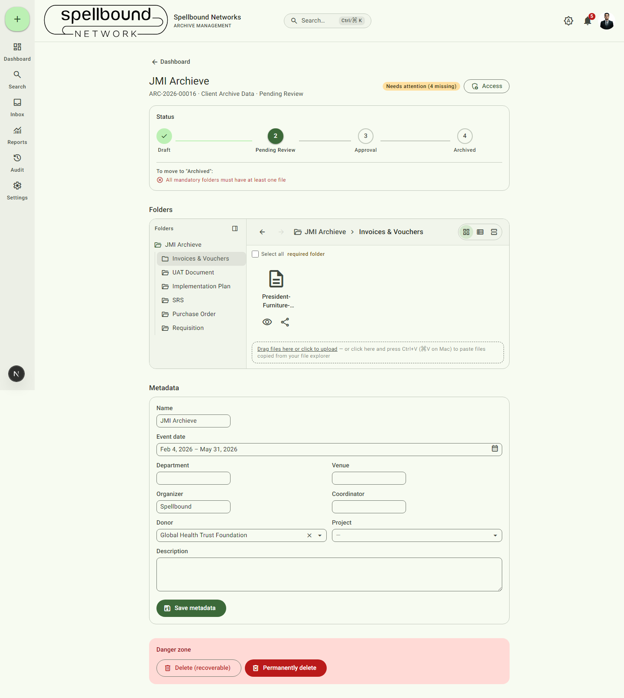
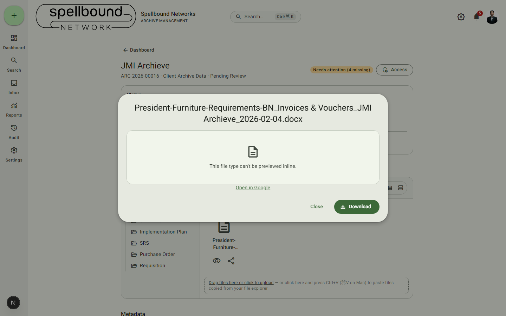
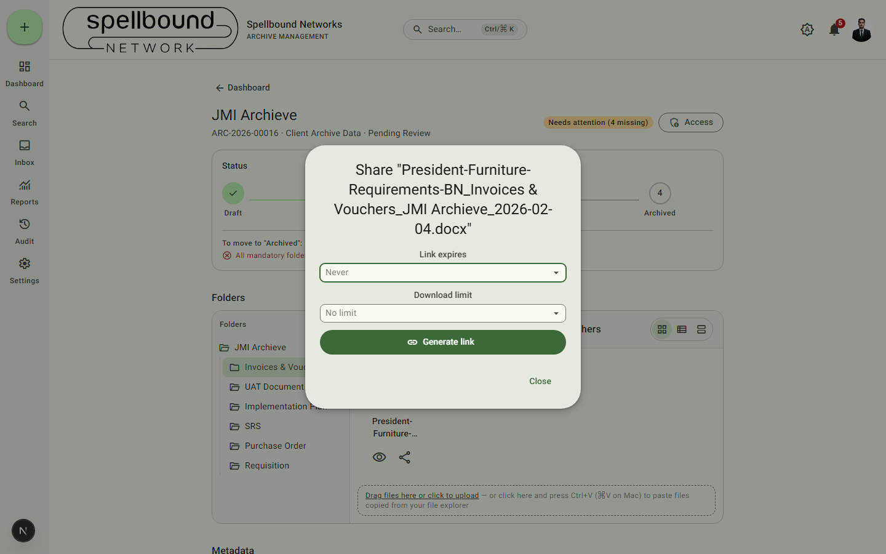

[← Manual home](README.md)

# Files

This page covers everything that happens inside a folder on an
[archive's detail page](03-archives.md#the-archive-detail-page): uploading,
versioning, previewing, downloading, opening in an external editor, and
sharing. For dropping in files with no archive/folder decided yet, see
[Migration Inbox](05-migration-inbox.md).

## Uploading

Open a folder, then either:
- **Drag and drop** one or more files onto the drop zone, or
- **Click the drop zone** to open a file picker, or
- Click into the drop zone and **press Ctrl+V** (⌘V on Mac) to paste files
  you've copied from your operating system's file explorer.

Each file gets its own progress bar and a completion checkmark, so uploading
several large files at once doesn't leave you guessing which one is stuck.

**Automatic renaming**: every uploaded file is renamed on the way in,
following your organization's configured pattern (folder name, archive name,
event date, etc.) — see
[File naming](settings/file-naming.md). You don't need to rename files
yourself before uploading.

## Versioning

Uploading a file with the **same name into the same folder** does not
overwrite the existing file — it creates a new version and marks it as the
current one. The file row's version history (expand it from the row) lets
you see and download prior versions. Nothing is ever silently lost to a
re-upload.

## Previewing a file

Select the **preview (eye) icon** on a file row to open it without
downloading:

- Images, video, and audio play/render directly in the dialog.
- PDFs render inline with a "open directly" fallback link.
- Word/Excel/PowerPoint files show the file icon and, if your organization
  has [connected Google Workspace or Microsoft 365](settings/integrations.md),
  an **Open in <provider>** button for full editing.
- Everything else shows as download-only.

Opening a preview or thumbnail is **not** logged as a download in the
[audit log](08-audit-log.md) or counted against a file's download count —
only an actual download is.

## Downloading

Use a file row's download control to save a copy locally. If your
organization has enabled watermarking (see
[Security & watermarking](settings/security.md)), image downloads and PDF
report exports carry a visible watermark — the stored original is never
altered, only what you receive.

## Selecting multiple files & bulk download

Use the checkboxes in the folder tree/file list to select files across
folders (a folder or archive-level checkbox selects everything inside it). A
floating selection bar appears with a **download selected as .zip** action —
useful for grabbing an entire archive's worth of files, or a handful spread
across folders, in one action.

## Opening in Google Workspace / Microsoft 365

If your organization has connected an external editor (see
[Integrations](settings/integrations.md)), Office-format files (Word, Excel,
PowerPoint) show an **Open in <provider>** action, which opens the file for
live co-editing in that service instead of downloading a local copy. Each
open is logged in the audit log as a download with a note (e.g. "opened in
google").

## Sharing a file publicly

Select the **share icon** on a file row:

1. Optionally set **Link expires** (a date/time after which the link stops
   working).
2. Optionally set a **Download limit** (the link stops working after N
   downloads — enforced so two people racing for the very last allowed
   download can't both succeed).
3. Select **Generate link** to create a public, unauthenticated link to that
   one file. Share it directly, or use the WhatsApp/email buttons that
   appear once a link exists.
4. Select **Close** when done.

Sharing is **per file only** — there's no public link for a whole folder or
archive (use the authenticated bulk zip-download above for that instead,
which still requires sign-in).

## Renaming, moving, and folder options

Each file row and folder card has a **⋮ (Options)** menu for the actions
appropriate to it (rename, etc.) — hover or focus the row to reveal it.
