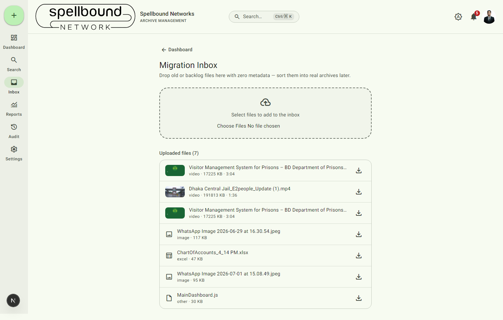

[← Manual home](README.md)

# Migration Inbox

The Migration Inbox is a landing zone for files you need to get into
Archivo *right now* but don't yet know the right archive/folder for —
typically old backlog files during an initial migration, or anything that
arrives before the paperwork deciding where it belongs. Open it from the
dashboard quick-actions row or the nav rail (**Inbox**).

## Uploading to the inbox

Select **Select files to add to the inbox** (or drag files onto the drop
zone) to upload with **zero required metadata** — no archive, no category,
no folder. This is the one place in the app where you can upload without
first deciding where a file belongs.

## Working the inbox

Each uploaded file shows its type, size, and (for video) duration, with a
**download** action to pull it back down if you need to double check its
contents before filing it. From here you sort files into their real home:
move each one into the correct archive and folder once you know where it
belongs, then it behaves exactly like any other uploaded file — see
[Files](04-files.md) for versioning, preview, and sharing once it's filed.

Think of the inbox as a queue to clear, not a permanent storage location —
files sitting here indefinitely aren't organized, searchable by archive, or
covered by folder-level access grants the way filed documents are.
