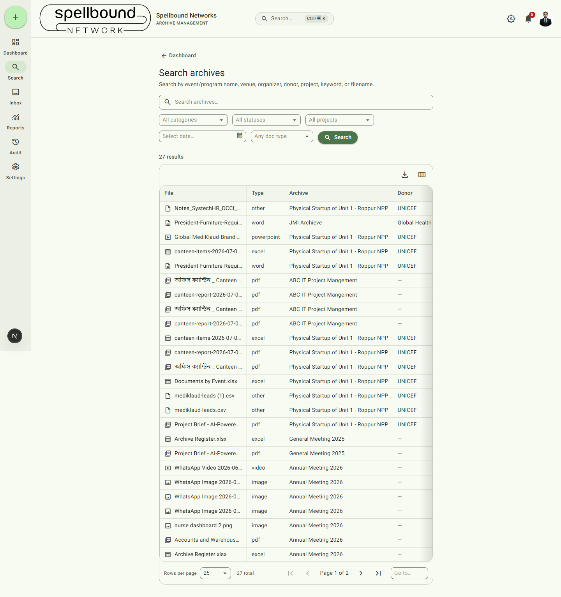

[← Manual home](README.md)

# Search

The full search page finds files across every archive you have access to.
Open it from the nav rail (**Search**), the dashboard quick-actions row, or
any dashboard shortcut card (e.g. "Pending Review").

## Basic search

Type into the free-text box and select **Search** (or press Enter). Free
text matches against event/program name, venue, organizer, donor, project,
keywords, and filename — you don't need to know which field a term is in.

## Advanced filters

Narrow results with any combination of:
- **Category** — the archive's category (Events, NGO Projects, …)
- **Status** — the archive's current workflow status
- **Project** — from your organization's configured project list
- **Date range** — a calendar picker
- **Doc type** — image, video, PDF, Word, Excel, PowerPoint, other

Filters combine (AND, not OR) — e.g. Category = Events **and** Doc type =
image finds only images inside Events-category archives.

## Working with results

- Each row shows the file's type icon, name, archive, donor, uploader, and
  upload date; selecting a filename opens its parent archive.
- **Configure columns** lets you show/hide, reorder (drag or keyboard), and
  the choice is remembered for next time.
- **Export** downloads the current result set (respecting your active
  filters) as Excel or PDF.
- Results paginate — use **Rows per page** and the page controls at the
  bottom for large result sets.

## What you can see

Search results are scoped to what your role and department allow — the same
visibility rules that apply to browsing archives directly apply here, so
search never surfaces something you couldn't otherwise open. See
[Roles & permissions](settings/roles.md).

## Quick search vs. full search

The dashboard's Search tab and the global **Ctrl/⌘K** command palette (see
[Dashboard](02-dashboard.md#global-search-ctrlk)) both offer a faster,
lighter lookup for jumping straight to a known archive or file. This page —
full Search — is the one with filters, sortable/configurable columns, and
export, for when you need to actually work with a result set rather than
just jump somewhere.
