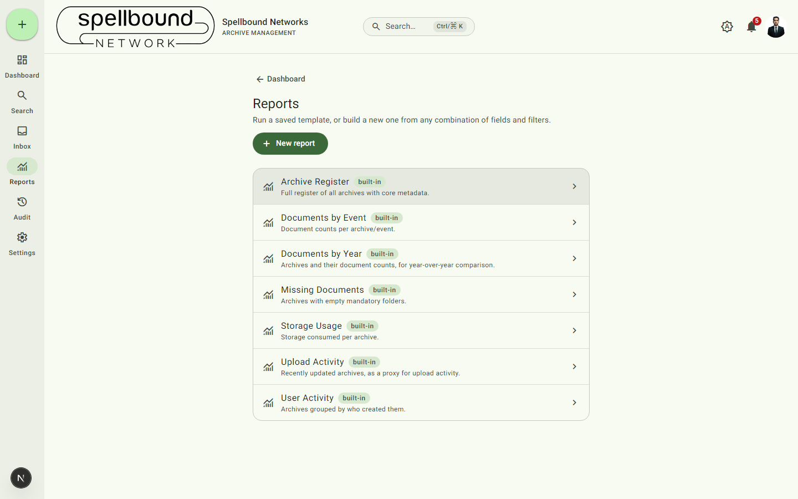
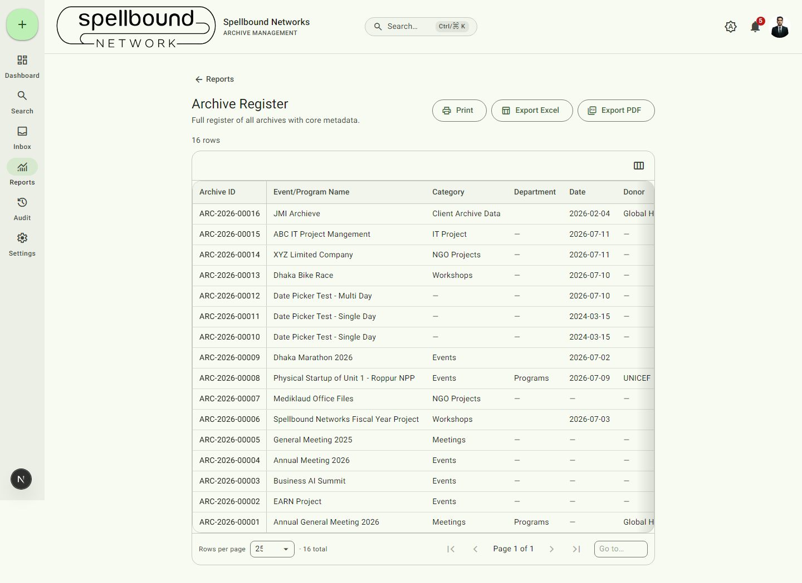
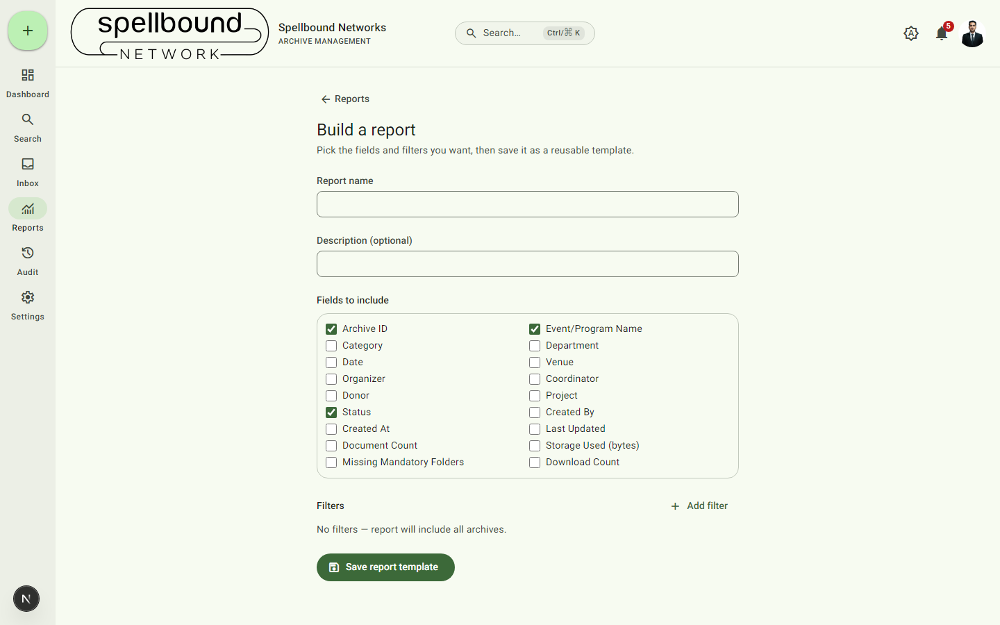

[← Manual home](README.md)

# Reports

Open **Reports** from the nav rail or dashboard. Reports are built on a
single reusable engine — the seven built-in reports below are just saved
configurations of the same tool you use to build your own, not separate
hardcoded pages.

## Built-in reports

- **Archive Register** — full register of all archives with core metadata
- **Documents by Event** — document counts per archive/event
- **Documents by Year** — archives and document counts, for year-over-year comparison
- **Missing Documents** — archives with empty mandatory folders
- **Storage Usage** — storage consumed per archive
- **Upload Activity** — recently updated archives, as a proxy for upload activity
- **User Activity** — archives grouped by who created them

Select any report's row to run it.

## Running a report

The result table respects the report's saved fields and filters. From here:
- **Print** — opens a print-friendly version (the app's navigation/toolbar
  are hidden automatically in the print output).
- **Export Excel** / **Export PDF** — downloads the current result set.
  PDF exports carry your organization's watermark if
  [watermarking](settings/security.md) is enabled; Excel exports don't (a
  watermark doesn't have an equivalent in spreadsheet cells).
- **Configure columns** — show/hide and reorder columns for this view.

## Building a custom report

Select **New report**:

1. **Report name** (required) and an optional **Description**.
2. **Fields to include** — pick any combination of raw archive fields
   (Category, Department, Donor, Status, …) and computed fields (Document
   Count, Storage Used, Missing Mandatory Folders, Download Count).
3. **Filters** — select **Add filter** to narrow which archives are
   included; leave empty to include everything.
4. Select **Save report template**.

Your new report appears in the Reports list alongside the built-in ones and
works identically — same run page, same export/print options. Report names
must be unique within your organization; saving a duplicate name shows a
friendly error instead of failing silently.
