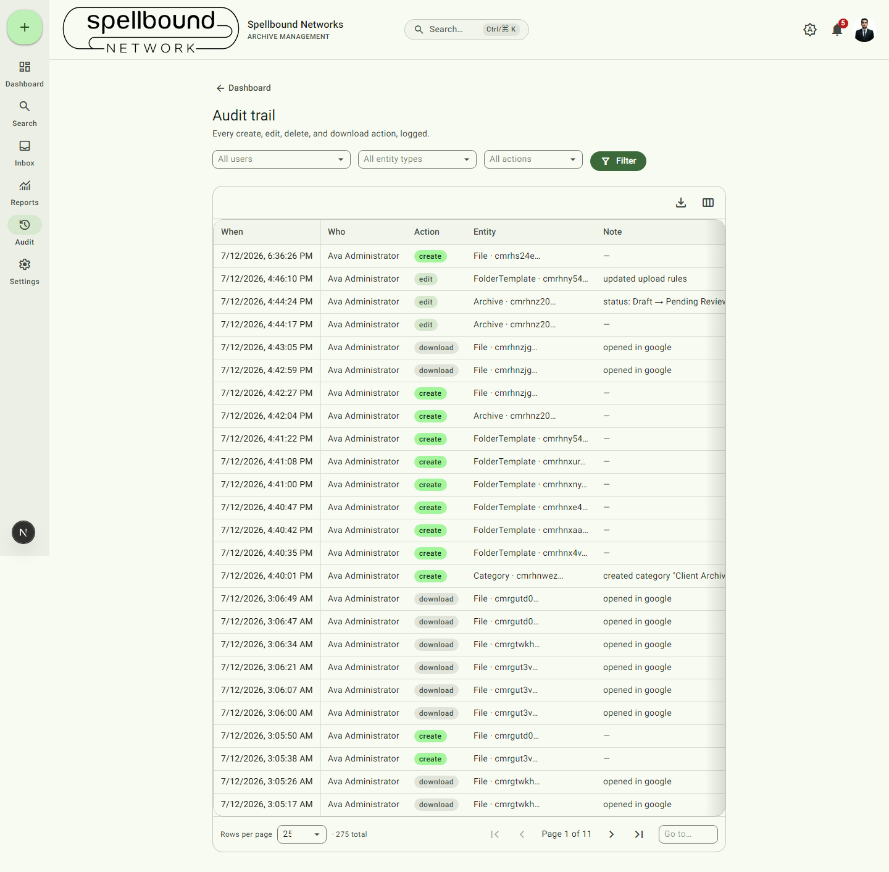

[← Manual home](README.md)

# Audit Log

Every create, edit, delete, and download action in the system is logged.
Open it from the nav rail (**Audit**) — this requires the "Manage users &
view audit trail" permission (see [Roles & permissions](settings/roles.md)).

## Reading an entry

Each row shows:
- **When** — exact timestamp
- **Who** — the user who performed the action
- **Action** — create / edit / delete / download
- **Entity** — what was affected (Archive, File, FolderTemplate, Category, …)
  and its ID
- **Note** — extra context where relevant (e.g. "status: Draft → Pending
  Review", "opened in google", "updated upload rules")

Opening a file **preview** or **thumbnail** is deliberately *not* logged as
a download — only an actual download (including "open in Google/Microsoft")
counts, so the trail reflects real data egress rather than every glance at a
thumbnail.

A bulk zip download of multiple files logs one summary entry for the
request, but each individual file still gets its own download entry
elsewhere so per-file download counts stay accurate.

## Filtering and exporting

- Use **Filter** to narrow by actor, action type, entity type, or date range.
- **Configure columns** — show/hide/reorder.
- **Export** — download the current filtered view as Excel or PDF, for
  compliance or record-keeping purposes.

Results paginate (275 total shown as "Page 1 of 11" in the example above) —
use the page controls at the bottom for older history.
