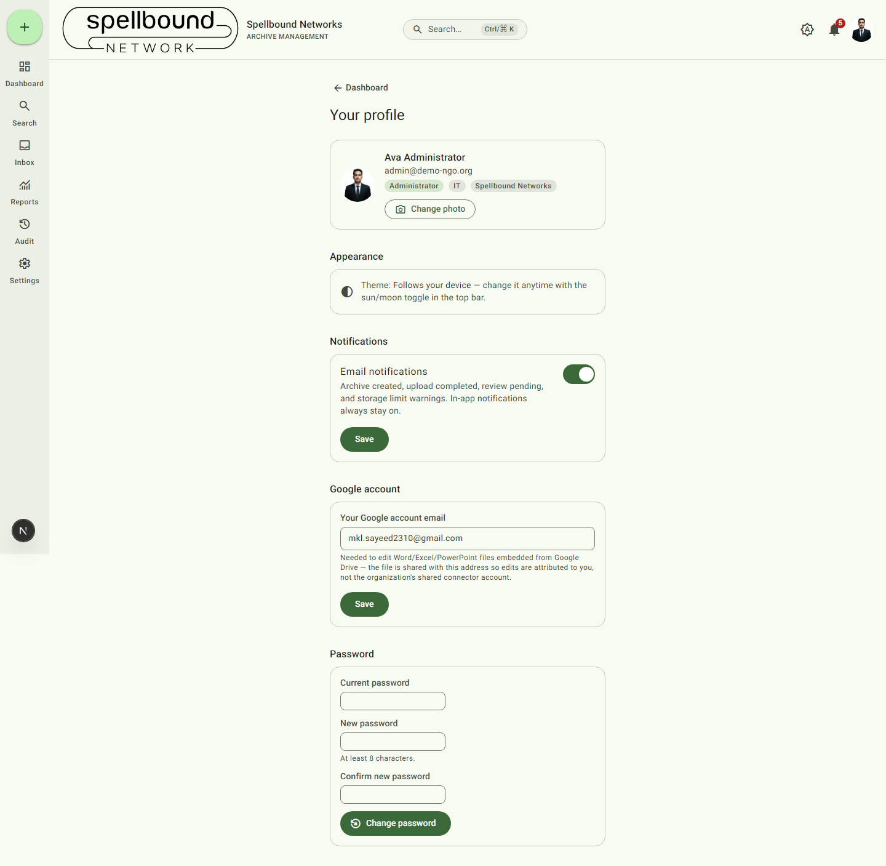

[← Manual home](README.md)

# Your profile

Personal, per-user settings — as opposed to [Settings](11-settings-overview.md),
which is organization-wide. Open it from the account menu (avatar → **My
profile**) or the command palette.

## Identity card

Shows your name, email, role, department, and organization — read-only here;
ask an Administrator to change your role or department (see
[Roles & permissions](settings/roles.md)).

**Change photo** uploads a new avatar. It's automatically resized to a
256×256 square, so any image works without ballooning storage usage. Your
avatar appears here and in the top-bar account menu (falls back to your
initials if you haven't set one).

## Appearance

Shows your current effective theme (light/dark/follows device) as a
reminder — change it anytime via the sun/moon toggle in the top bar. This
overrides your organization's [default theme](settings/appearance.md) for
you personally without affecting anyone else.

## Notifications

**Email notifications** toggle — covers archive created, upload completed,
review pending, and storage limit emails (see
[Notifications](09-notifications.md)). In-app notifications (the bell)
always stay on regardless of this setting. Select **Save** after changing
it.

## Google account

If your organization has [connected Google Workspace](settings/integrations.md),
enter **your** Google account email here. This is what lets files opened
"in Google" be shared with *you* specifically and attributed to you, rather
than everything funneling through the organization's shared connector
account. Select **Save**.

## Password

Change your password by entering your **Current password**, then a **New
password** (at least 8 characters) and confirming it. Select **Change
password**. Your current password is verified before the change is
accepted — there's no way to reset it here without knowing it (use an
Administrator for account recovery).
