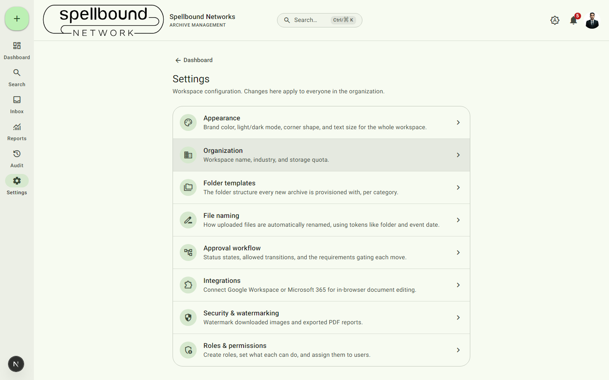

[← Manual home](README.md)

# Settings overview

Settings is workspace configuration — changes here apply to **everyone** in
the organization, unlike [Your profile](10-profile.md) which is personal.
Open it from the nav rail or dashboard quick-actions row. It requires the
"Manage organization settings" permission
(`canManageSettings` — see [Roles & permissions](settings/roles.md)); anyone
without it won't see Settings in their navigation at all.

## Pages

| Page | What it controls |
|---|---|
| [Appearance](settings/appearance.md) | Brand color, light/dark default, corner shape, text size for the whole workspace |
| [Organization](settings/organization.md) | Workspace name, industry, storage quota |
| [Folder templates](settings/folder-templates.md) | The folder structure every new archive is provisioned with, per category |
| [File naming](settings/file-naming.md) | How uploaded files are automatically renamed |
| [Approval workflow](settings/workflow.md) | Status states, allowed transitions, and the requirements gating each move |
| [Integrations](settings/integrations.md) | Connect Google Workspace or Microsoft 365 for in-browser document editing |
| [Security & watermarking](settings/security.md) | Watermark downloaded images and exported PDF reports |
| [Roles & permissions](settings/roles.md) | Create roles, set what each can do, and assign them to users |

Each links back here, and each notes any permission requirement beyond the
baseline `canManageSettings` gate (a couple of actions additionally require
`canManageUsers`).
