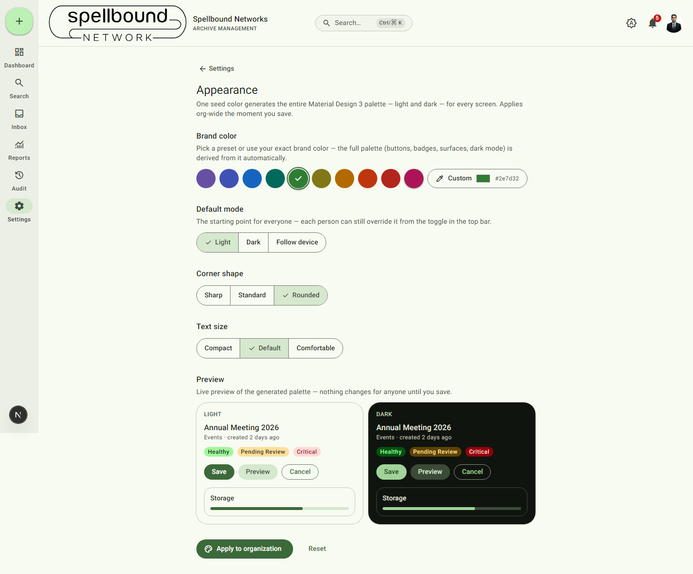

[← Settings overview](../11-settings-overview.md) · [Manual home](../README.md)

# Appearance

Controls the visual theme for the whole workspace — every screen, every
user, derived from a single brand color. Requires `canManageSettings`.

## How it works

Pick or enter one **Brand color** (a preset swatch, or **Custom** with a hex
value) and the entire palette — buttons, badges, surfaces, both light and
dark mode — is generated from it automatically. You don't configure colors
individually anywhere else in the app.

1. **Brand color** — choose a preset or enter a custom hex value.
2. **Default mode** — Light, Dark, or Follow device. This is the *starting
   point* for everyone; each person can still override it for themselves via
   the sun/moon toggle in the top bar or at [their profile](../10-profile.md#appearance).
3. **Corner shape** — Sharp, Standard, or Rounded. Affects the corner
   radius of buttons, cards, and inputs workspace-wide.
4. **Text size** — Compact, Default, or Comfortable.
5. Check the **Preview** panel (shown in both light and dark) before
   committing.
6. Select **Apply to organization** to save, or **Reset** to discard changes
   and revert the form to the currently-saved values.

Nothing changes for anyone until you select **Apply to organization** — the
preview is local to your screen while you're adjusting it.
