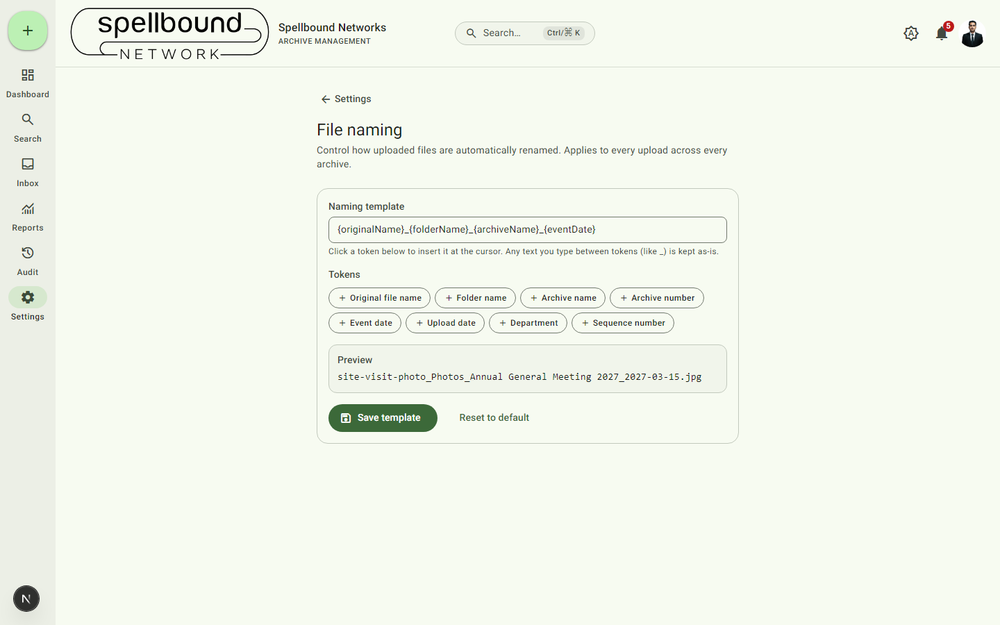

[← Settings overview](../11-settings-overview.md) · [Manual home](../README.md)

# File naming

Controls how every uploaded file is automatically renamed, across every
archive and every folder in the organization. Requires `canManageSettings`.



## How it works

The **Naming template** is built from tokens plus any literal text you type
between them (like `_`). Available tokens:

- Original file name
- Folder name
- Archive name
- Archive number
- Event date
- Upload date
- Department
- Sequence number

Select a token to insert it at the cursor position in the template field.
The **Preview** below updates live, e.g.:

```
site-visit-photo_Photos_Annual General Meeting 2027_2027-03-15.jpg
```

Select **Save template** to apply it to all future uploads (past uploads
keep the names they already have — this isn't retroactive), or **Reset to
default** to restore the built-in pattern.

## Why this matters

Because renaming happens automatically on upload, people uploading files
don't need to follow a manual naming convention themselves — consistency is
enforced by the system, not by asking everyone to remember the rules. This
is what makes filenames useful in [Search](../06-search.md) results and
exports without extra effort from whoever uploaded the file.
