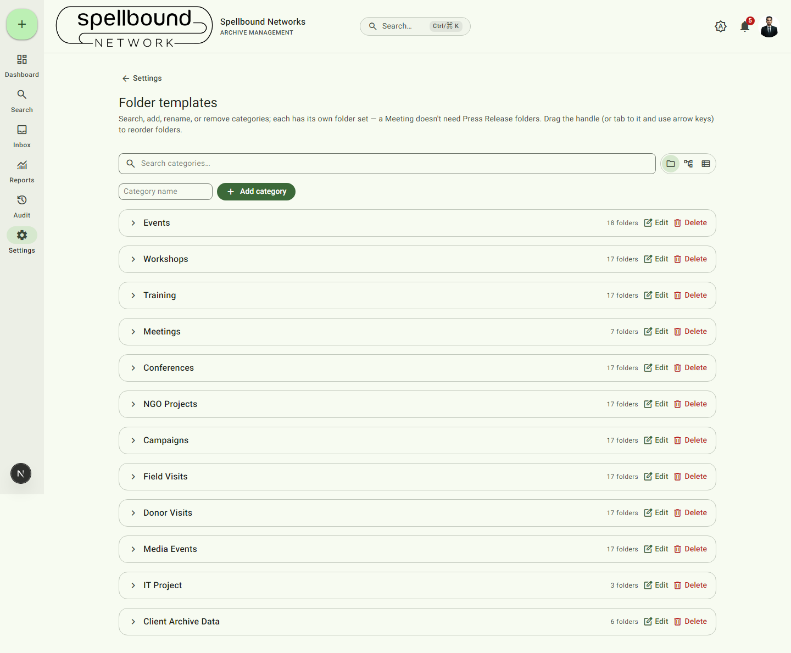

[← Settings overview](../11-settings-overview.md) · [Manual home](../README.md)

# Folder templates

Defines the folder structure every new archive is automatically provisioned
with, per category — a Meeting doesn't need the same folders as a Press
Release. Requires `canManageSettings`. Changing a template only affects
*new* archives created after the change; existing archives keep whatever
folders they already have.

## Layout

- **Search** categories by name.
- Three view toggles — **Folders view** / **Explorer view** / **List
  view** — for browsing the same data differently depending on whether
  you're scanning many categories at once or drilling into one.
- **Add category** — type a name and submit to create a new, empty
  category (add its folders afterward).

## Categories

Each category row shows its name and folder count, with:
- **Edit** — rename the category.
- **Delete** — removes the category. Archives already using it keep their
  existing folders; only the *template* is removed, so future archives in
  that category won't be auto-provisioned the same way (effectively
  retiring it).

## Folders within a category

Each folder row has:
- A **drag handle** to reorder (or select it and use the Up/Down arrow keys)
  — this sets the order folders appear in on every archive of that category.
- A toggle for whether the folder is **required** — required folders must
  contain at least one file before certain [workflow](workflow.md)
  transitions are allowed (shown as "required" badges on archive detail
  pages).
- **Edit** — rename the folder.
- **Rules** — configure upload rules for that folder: which file types are
  accepted and any per-type minimum file count. These rules feed the
  workflow engine's "All configured per-type minimum file counts must be
  met" requirement (see [Approval workflow](workflow.md)) and are enforced
  at upload time, not just at status-change time.
- **Remove** — deletes the folder from the template (again, only affects
  future archives).

## How this connects to the rest of the app

- Choosing a category on [archive creation](../03-archives.md#creating-an-archive)
  provisions exactly the folders configured here, in the order set here.
- The **required** flag drives both the "Needs attention" state of
  [Archive Health](../00-introduction.md#core-concepts) and what blocks a
  [workflow transition](workflow.md).
- Reordering here is purely presentational — it doesn't retroactively move
  files or change anything about existing archives beyond the order their
  folders are displayed in for *new* archives going forward.
