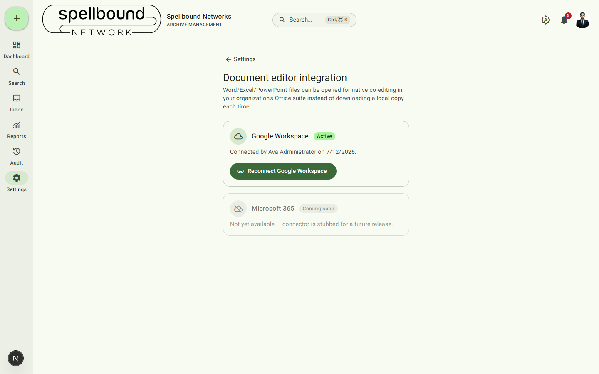

[← Settings overview](../11-settings-overview.md) · [Manual home](../README.md)

# Integrations

Connects your organization to Google Workspace or Microsoft 365 so
Word/Excel/PowerPoint files can be opened for live co-editing instead of
downloading a local copy every time. Requires `canManageSettings`.

## Google Workspace

Select **Connect Google Workspace** (or **Reconnect** if already connected)
to start the OAuth flow. Once connected, the card shows **Active** with who
connected it and when. The requested permission scope is deliberately
narrow — only files this app itself creates or opens, not your organization's
whole Drive.

Once connected, every user who wants to use "Open in Google" should also add
**their own** Google account email at [their profile](../10-profile.md#google-account)
— this is what makes an edit show up as coming from that person rather than
the organization's shared connector account.

## Microsoft 365

Shown as **Coming soon** — the connector exists in the codebase as a
documented stub but isn't available to connect yet.

## What connecting enables

Once a provider is active, Office-format files across the app gain an
**Open in <provider>** action (on file rows and in the
[file preview dialog](../04-files.md#previewing-a-file)) alongside the
normal download option. Each open is recorded in the
[audit log](../08-audit-log.md) as a download with a note like "opened in
google".
