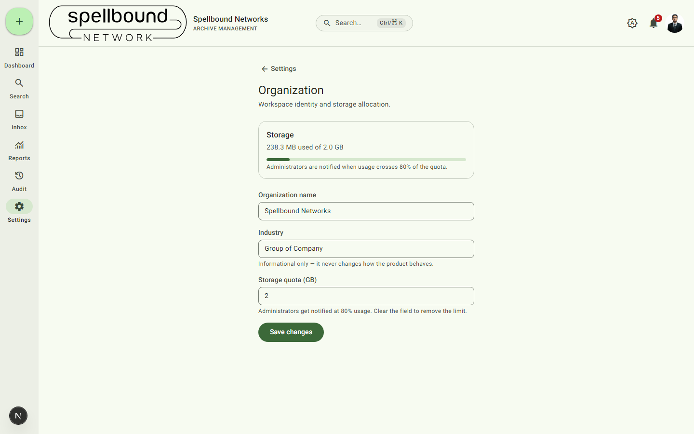

[← Settings overview](../11-settings-overview.md) · [Manual home](../README.md)

# Organization

Workspace identity and storage allocation. Requires `canManageSettings`.

## Fields

- **Storage** — a read-only usage meter (e.g. "238.3 MB used of 2.0 GB")
  shown at the top for context before you change the quota below.
- **Organization name** — shown in the top bar, browser tab, and anywhere
  the workspace is identified.
- **Industry** — informational only; it never changes how the product
  behaves (it doesn't switch feature sets or terminology).
- **Storage quota (GB)** — the ceiling before Administrators start getting
  80%-usage warnings (see [Notifications](../09-notifications.md)). Clear
  the field entirely to remove the limit — by default, new organizations
  have no quota configured, so no warnings fire until you set one.

Select **Save changes** to apply.
