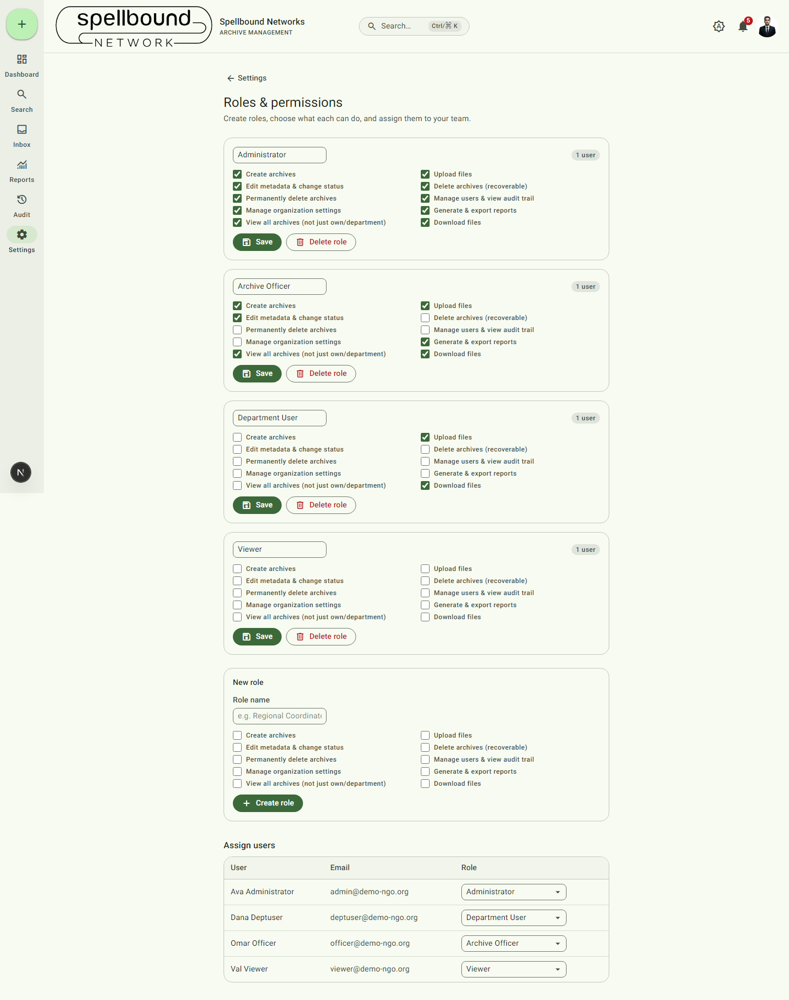

[← Settings overview](../11-settings-overview.md) · [Manual home](../README.md)

# Roles & permissions

Create roles, choose exactly what each can do, and assign people to them.
The page itself requires `canManageSettings`; assigning a *user* to a role
(as opposed to editing role definitions) additionally requires
`canManageUsers`, since that's more of a user-management action than a
settings-shape one.

## Permission flags

Every role — built-in or custom — is a combination of these 10 independent
flags:

- Create archives
- Upload files
- Edit metadata & change status
- Delete archives (recoverable)
- Permanently delete archives
- Manage users & view audit trail
- Manage organization settings
- Generate & export reports
- View all archives (not just own/department)
- Download files

There's no deeper granularity than these 10 (e.g. no per-category or
per-archive permission) — combine them to approximate the access level you
need. The four demo roles (Administrator, Archive Officer, Department User,
Viewer — see the [manual home](../README.md#roles-referenced-throughout-this-manual))
are just one particular combination each; rename or reconfigure them, or add
new roles entirely.

## Editing an existing role

Each role card lists its user count and the 10 checkboxes. Check/uncheck as
needed and select **Save**. **Delete role** removes it — if any users are
still assigned to it, deletion is blocked and the message tells you exactly
how many users are affected, rather than failing with a generic database
error; reassign those users first.

## Creating a role

Fill in **Role name** under "New role", check the permissions it should
have, and select **Create role**.

## Assigning users

The **Assign users** table lists every user with their email and a role
dropdown — change a person's role by picking a new value from their row's
dropdown. This is the only place role assignment happens; there's no
separate "invite user" flow documented here beyond changing an existing
account's role (user creation/deactivation isn't part of this page).
