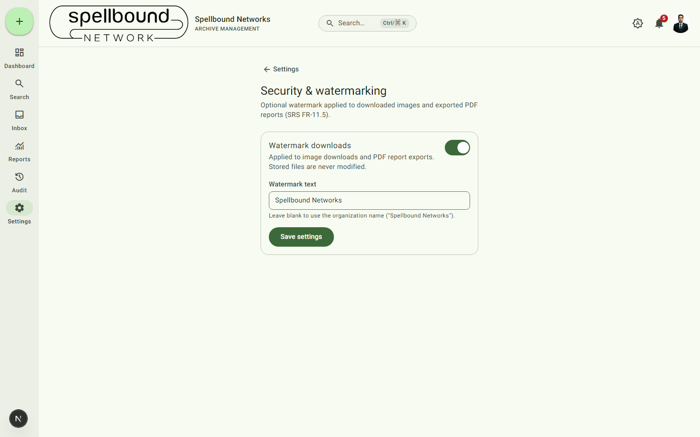

[← Settings overview](../11-settings-overview.md) · [Manual home](../README.md)

# Security & watermarking

Controls an optional watermark applied to downloaded images and exported PDF
reports — protecting content once it leaves the system without altering
anything in storage. Requires `canManageSettings`.

## Settings

- **Watermark downloads** — toggle on/off. When on, it applies to:
  - **Image downloads** — a semi-transparent text overlay is composited
    onto the file at the moment of download.
  - **Exported PDF reports** (see [Reports](../07-reports.md)) — a
    repeated, rotated, low-opacity text pattern across every page.
- **Watermark text** — leave blank to default to your organization's name;
  set custom text to override it.

Select **Save settings** to apply.

## What's not watermarked

- The **stored file is never modified** — only the bytes you receive at
  download time change. Turn watermarking off and downloads go back to
  being byte-for-byte identical to the original.
- **Excel exports** are not watermarked — a background watermark doesn't
  have an equivalent in spreadsheet cells.
- Raw **Word/Excel/PowerPoint file downloads** are not watermarked — only
  images and PDF report exports are covered. Watermarking arbitrary Office
  documents would require format-specific editing rather than an overlay,
  and is out of scope for this feature.
- **Previewing** a file (see [Files](../04-files.md#previewing-a-file))
  never applies a watermark — only an actual download does.
