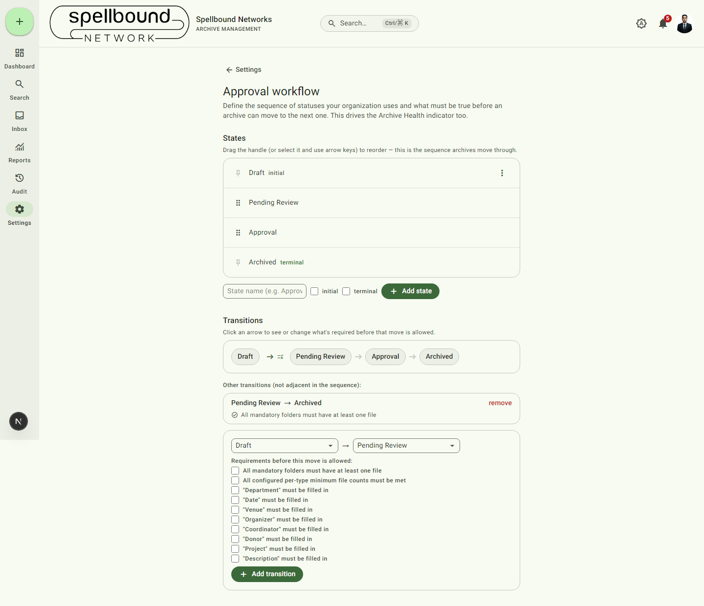

[← Settings overview](../11-settings-overview.md) · [Manual home](../README.md)

# Approval workflow

Defines the sequence of statuses your organization uses for archives and
what must be true before an archive can move from one to the next. This
same configuration drives the **Archive Health** indicator shown throughout
the app. Requires `canManageSettings`.

## States

The **States** list is the ordered sequence archives move through (e.g.
Draft → Pending Review → Approval → Archived).

- Drag the handle (or select a row and use Up/Down arrow keys) to reorder.
- The **initial** state (pinned first, marked with a pin icon) is where
  every new archive starts. The **terminal** state(s) (pinned last) mark an
  archive as finished. Pinned states aren't draggable — a new state you add
  is automatically inserted at the correct end, or just before the terminal
  state if it's neither.
- Each row's **⋮** menu offers:
  - **Edit** — rename the state, or change its initial/terminal flags.
    Renaming cascades automatically to every transition that references the
    old name and to any archive currently sitting in that status, so
    nothing is silently orphaned.
  - **Duplicate** — copies the state as "<name> (copy)", always as a plain
    (non-pinned) state.
  - **Delete** — removes the state. (If an archive's status no longer
    matches any configured state — e.g. after a state is deleted — its
    Archive Health falls back to "needs attention" rather than being
    silently reported healthy.)
- **Add state** — type a name, optionally flag it initial/terminal, and
  select **Add state**. You can't add a second initial state, or one
  flagged both initial and terminal.

## Transitions

Shows the direct sequence as connected arrows, plus an **"Other
transitions"** list below for any move you've configured between
non-adjacent states (e.g. skipping straight from "Pending Review" to
"Archived"). Select an arrow to open its detail panel:

- Check off which **requirements** must be satisfied before that specific
  move is allowed — options include "all mandatory folders must have at
  least one file", "all configured per-type minimum file counts must be
  met" (see [Folder templates → Rules](folder-templates.md)), and
  "<field> must be filled in" for each metadata field (Department, Date,
  Venue, Organizer, Coordinator, Donor, Project, Description).
- **Add transition** — define a new from → to move and its requirements.
- **remove** — deletes a transition entirely.

## How enforcement works

Status can only change through this configured set of transitions — there's
no way to set an arbitrary status directly, including through the
[archive metadata form](../03-archives.md#metadata). Requirements are
re-checked on the server every time a move is attempted, not just reflected
in the UI — so even if someone found a way to click a technically-disabled
button, the move would still be rejected server-side if requirements aren't
actually met.

## Effect on Archive Health

An archive sitting in a non-terminal state with unmet requirements for its
next move shows **Needs attention**; one in a terminal state (or with every
requirement met) shows **Healthy**. If your organization hasn't configured
any states yet, or an archive's status doesn't match any configured state
name, health resolution defaults to "needs attention" rather than assuming
everything is fine.
